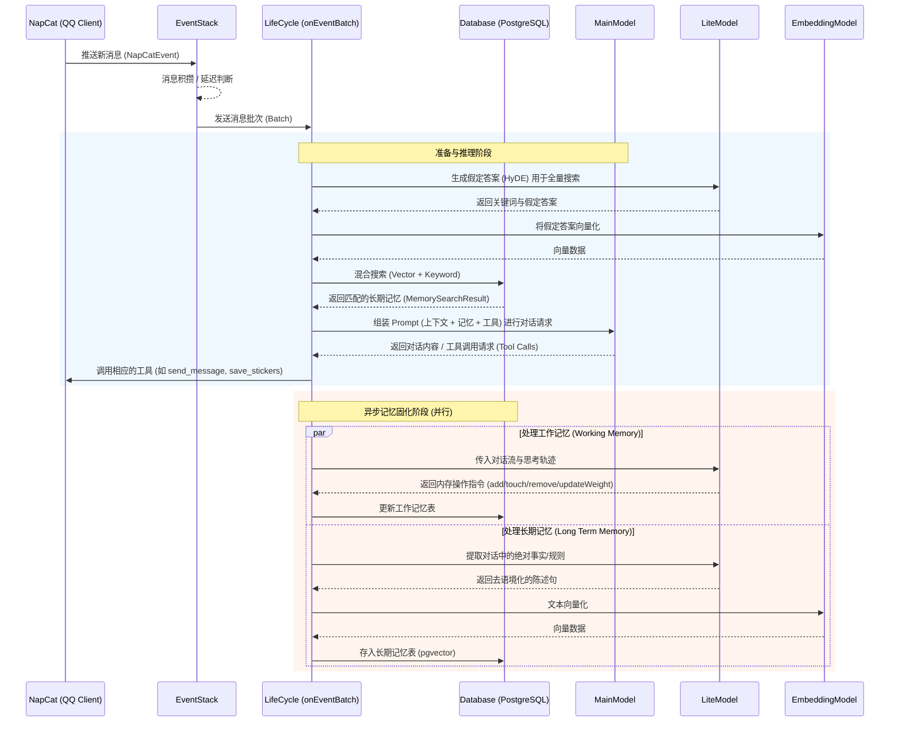

# Shards - AI Agent Bot

Shards 是一个基于 NapCat 和大语言模型构建的高级 QQ 机器人。它不仅能进行日常交流，还拥有复杂的双层记忆架构（工作记忆与长期记忆），并能在后台通过“做梦”机制自动沉淀知识和群组氛围。

## 核心特性

- **多模型协作**：分离主对话、记忆整理、向量化和视觉识别任务，以达到最佳性能与成本平衡。
- **动态工作记忆**：实时跟踪对话焦点，根据权重（Weight）机制判断话题重要性，自动淘汰无意义的闲聊玩梗。
- **长期记忆与混合检索**：基于 PostgreSQL + `pgvector` + `pg_trgm`，实现高精度的向量与关键字混合搜索。
- **潜意识沉淀 (Dreaming)**：闲时自动回顾工作记忆，提取有价值的长期人物画像和事实规则。
- **丰富的工具链 (MCP)**：支持发送/转发消息、读取群/好友信息、图片解析、表情包收藏与发送等。

## 运行前准备

### 1. 环境依赖

- Node.js 18+ (pnpm)
- PostgreSQL: 安装 `pgvector` 和 `pg_trgm` 扩展
- NapCat

```shell
pnpm install
```

### 2. 模型 (OpenAI API 兼容格式)

系统需要四个不同的模型端点，你可以使用同一个大模型，但推荐拆分以降低成本：

- **Main Model (`MODEL`)**: 主力聊天模型，需要极强的 Tool Calling 能力和推理能力。最好多模态。
- **Lite Model (`LITE_MODEL`)**: 轻量模型，用于后台信息提取、搜索词扩展和记忆沉淀（Dreaming）。
- **Embedding Model (`EMBEDDING_MODEL`)**: 向量模型，用于将文本转换为向量。建议本地部署。
- **Image Model (`IMAGE_MODEL`)**: 视觉模型，用于解析表情包和图片。

除了主模型外，子模型未填写的配置项会默认复用主模型的。

### 3. 检查数据库初始化 SQL

在首次运行前，请务必检查 `src/sql/init.sql` 中的向量维度设置。默认设置为 `768` 维(nomic-embed-text)：

```sql
create table long_term_memory
(
    id         serial primary key,
    content    text        not null,
    embedding  vector(768) not null, -- 注意这里！
    created_at timestamptz not null default now()
);
```

如果你使用的 EMBEDDING_MODEL 输出的维度不是 768（例如 OpenAI 的 text-embedding-3-small 默认是 1536），需要将 vector(768)
修改为你对应模型的维度。

### 4. 填写 `.env`

复制 `.env.example` 为 `.env`，并根据你的环境配置相应的变量

### 5. 填写 `prompt`

`/prompt/sys.md` 要自己写，这是人物基础设定。
`/prompt/hint.md` 要自己写，这是每次在消息后告诉主模型要做什么的。记得提醒它合法闭嘴权。

`/prompt/` 目录下的其他 md 文件是一些基础的提示词模板，可以根据需要修改或扩展。

### 6. `pnpm run start`

### tips

~~我用的napcat被我爆改过，injectPttText自己扬掉。~~ PR合并了请使用26.5.13以后的napcat构建。

主模型支持语音的去把tools里面语音相关的一个工具一个类取消注释了。

觉得自己模型快的飞起的可以把LongTermMemory的fullSearch改回用extendFullMemorySearch的。

### 外部日志查看器

写了一个简单的例子，需要复杂的自己看着例子改，在 `src/utils/logger.ts` 里注册你的 handler 就好了。

需要看例子的，把env的`LOG_WS_PORT`改成你想要的端口，前端示例在[log-viewer](https://github.com/Bluemangoo/log-viewer)，把构建后文件复制到frontend目录下就可以了。

## 架构

Shards 采用多层架构，将消息接收、推理决策与记忆整理异步分离。

1. 事件捕获层: node-napcat-ts 持续监听 QQ 事件。消息不会被立刻处理，而是压入 EventStack（事件栈）。
2. 缓冲层: EventStack 会根据消息数量和时间延迟进行批处理。当达到触发条件（默认5条/60s）或被显式唤醒时（例如被@），将一组消息发送给生命周期管理器。
3. 主处理循环：
    - `onEventBatch` 会在请求主模型前，根据当前上下文前往 `LongTermMemory` 执行向量化搜索（HyDE 预查），获取相关的历史设定。
    - image model 解析消息中的图片和表情包，注入event。
    - main model 获取系统 Prompt、当前聊天窗口信息、历史轨迹以及记忆，并可能触发各类 Tools 操作（发消息也使用tools）
    - lite model 评估本次对话，下发 JSON 指令对带权重的 LRU 工作记忆进行 add/update/remove
    - lite model 提取本次对话中具有绝对价值的事实或规则，调用 EmbeddingModel 存入数据库。
4. 潜意识沉淀（Dreaming）: 每 30 分钟苏醒一次，取出工作记忆，由 lite model 提炼人物性格氛围等内容，沉淀到长期记忆中 。

### 消息处理过程

注，这图 ai 画的。



## ignore file update

```shell
git update-index --assume-unchanged src/inject.ts
git update-index --assume-unchanged prompt/dev.md
git update-index --assume-unchanged prompt/dreaming.md
git update-index --assume-unchanged prompt/image.md
git update-index --assume-unchanged prompt/memory.add.md
git update-index --assume-unchanged prompt/memory.full.search.md
git update-index --assume-unchanged prompt/memory.search.md
git update-index --assume-unchanged prompt/working.memory.md
```

## 附注

代码中混乱的命名规则(驼峰和下划线)一部分是为了匹配 napcat 的，另一部分情况是因为最开始是在 python 写的，迁过来的时候没改。ts 我还是喜欢大小驼峰。

`/data/temp_stickers` 可以直接清理。

看起来莫名其妙的地方很多是历史遗留问题，有兴趣可以pr一下改了。

关于记忆可以看一下[这篇](https://docs.google.com/document/d/1jck_Y1K58rwb2v5hJlBckE8fqpoWztwqL7_Ey6wQwdI/edit?usp=sharing)。ai写ai用。
